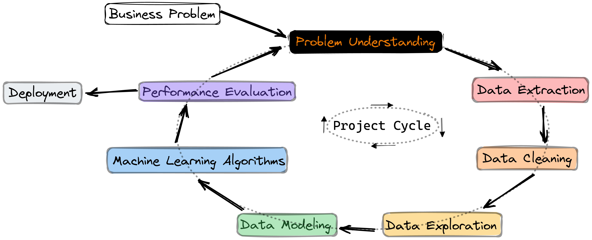

# **BUSINESS PROBLEM**

## **What is the company?**

A3Data

## **What is its business model?**

A3Data is one of the leading consultancies specialising in data and artificial intelligence in Brazil. The company focus on the cultural and the analytical transformation of medium and large organizations.

## **What is the business problem the company is facing?**

A3Data was given the task to find out what are the main factors associated with aeronautical accidents given the public database from the Brazilian Aeronautical Accident Investigation and Prevention Center. These factors (and insights) from this analysis will be used for public campaigns to advise the population, politicians and companies about what should be done to reduce the number of accidents.

# **PROBLEM UNDERSTANDING**

## **What is the business solution that this project has to deliver?**

Based on the given dataset, this project has to deliver insights that could be used in public campaigns to reduce the number of aeronautical accidents. These insights will be delivered in the format of a presentation with concise explanations about the process used to explore the data available, about what were the raised and validated hypotheses, and what were the concluding insights.

References:
https://dados.gov.br/dataset/ocorrencias-aeronauticas-da-aviacao-civil-brasileira

# **BUSINESS ASSUMPTIONS FOR THIS CYCLE**

- The main goal of this project is to find out what are the most main factors regarding aeronautical accidents

- All *** values mean that data is not available (missing data)

# **SOLUTION STRATEGY**

## **Input**

- **Business problem**: data exploration to raise intelligence from available data

- **Business questions**: what are the main factors associated with aeronautical accidents that could be used in public campaigns to reduce the number of aeronautical accidents

- **Available data**: a public database from the Brazilian Aeronautical Accident Investigation and Prevention Center

## **Output**

- A **presentation** with:
    - concise explanations about the process used to explore the data available
    - what were the raised and the validated hypotheses
    - what were the concluding insights

- A **Github repository** with the **code** used

## **Tasks**

- What are the **main factors** related to **aeronautical accidents**:

    - **1** - Understand what is the main goal
    - **2** - Define the scope of the solution (for this project cycle)
    - **3** - Understand the data available (at a high level)
    - **4** - Load the data and merge the required tables
    - **5** - Clean and prepare the data for analysis  
    - **6** - Define hypotheses that will be tested on the present project cycle
    - **7** - Search for rows with misleading data (regarding business understanding)
    - **8** - Explore the data to get insights
    - **9** - Prepare the storytelling regarding what is required for the final product

# **PROJECT CYCLE**

## Step 01. Business Problem

Understand what problem we are trying to solve and what is its business context. Besides, we try to understand what are the deliverables, what are the business questions to be answered and what are the main concerns of this problem.

## Step 02. Problem Understanding

Define the scope of the solution for the present project cycle and understand what seems to be the greatest challenges. Understand what data we have available and plan how to use data science tools to solve the business problem.

## Step 03. Imports

Set initial code configurations for the project, load python libraries and load the library made specifically for this project

## Step 04. Data Extraction

Understand Entity-Relationship Diagram, load data from the available files and merge the required dataframes.

## Step 05. Data Description

Rename columns, check dataframe dimensions, check data types, and check missing values and duplicate rows. Then use statistics metrics to identify data outside the scope of business.

## Step 06. Feature Engineering

Create a hypothesis list to check in the final Exploratory Data Analysis section. Then create relevant variables for the project.

## Step 07. Data Filtering

Filter rows and columns that do not contain relevant information or that do not match the scope of the business.

## Step 08. Exploratory Data Analysis

Inspect the relations between variables, explore data to find insights and validate the required hypotheses.

## Step 09. Deploy
Deploy the product of the present project cycle in the required format.

## Restart the cycle
Analyse feedback from the last project iteration and use it as a guide for improvements in the next project cycle.

# **TOP 3 INSIGHTS**

- **Hypothesis I: the number of accidents in the state with most accidents is at least 50% higher than the average of the remaining states.**

*Hypothesis I is TRUE.* SP is the state with the highest number of accidents and the number of accidents in SP (alone) is 8.72 times the average number of accidents in all remaining other states.

*Possible actionable: 
SP is a key state when trying to reduce the total number of accidents in Brasil. As a first solution, the testing campaigns ought to be tested in this state (as the campaign performance could be more readily apparent).*

- **Hypothesis II: summer has a number of accidents at least 10& larger than the average of remaining seasons.**

*Hypothesis II is TRUE.* The number of accidents in the summer is about 15% higher than the average number of accidents in the remaining seasons.

*Possible actionable:
There is some difference between number of accidents in different seasons; however, this difference is not very large. In this could indicate that campaigns ought to be consistent throughtout the year in order to achieve meaningful results in terms of accident reduction.*

- **Hypothesis III: the number of accidents with private aircraft is more than 70% of the total number of accidents.**

*Hypothesis III is FALSE.* The number of accidents with private aircraft is about 34% of the total number of accidents.

*Possible actionable:
Private aircraft alone corresponds to more than 30% of the total number of accidents. So, campaigns ought to also focus on private aircraft and not only "companies/business" aircraft to achieve meaningful results.*

# **BUSINESS SOLUTION**

- the **code** used for this case on GitHub

- a pdf **presentation** with:
  - (1) the presentation of the **challenge**; 
  - (2) an explanation of the **process** used; 
  - (3) **hypotheses raised**;
  - (4) **exploratory analysis**; and 
  - (5) **conclusions** and **insights** generated
  
# **CONCLUSIONS**

Not all data science projects require modelling, this job application case is a clear example.

Doing a project with a very strict deadline (48 hours) not only requires good **time management** skills but also good **task prioritization** skills.

Without a clear **business problem** and **context**, it is much harder to **guide** what are the best **decisions** to make, and what **assumptions to raise** and **explore** the data to achieve **meaningful insights**. To overcome all of this, we decided to create a business context around this project.

# **LESSONS LEARNED**

**Task prioritization** due to the very strict deadline of this case (48 hours)

How to **set** a **business context** for an open case to keep the solution as close as possible to a real scenario and also to have a **guide** to make **assumptions** and make **decisions** throughout the project.

How to do a data science project where the deliverable is not a model to make some predictions.

How to plan the **storytelling** to make the project accessible to others.

# **NEXT STEPS TO IMPROVE**

**Exploaroty Data Analysis**: raise more hypotheses to validate and explore the relationship between variables deeper.

**Business Understanding**: collect feedback from the last project cycle and use it to improve business understanding. Revise the planned solution for this project (according to the IoT method) and update it according to feedback.

**Database**: research for a better description of every column in the database to further understand (and use) available data.

**Feature Engineering**: explore feature creating to find out new relevant features (and metrics) for the project solution.

**Storytelling**: get feedback for the first presentation and use it to improve the storytelling template for the next cycle.